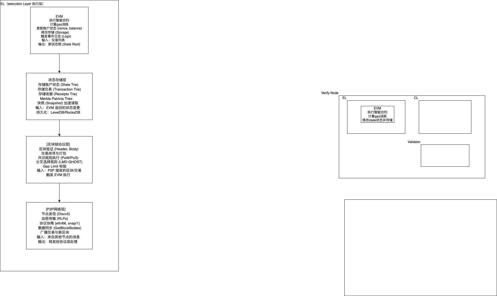

# 阐述Geth在以太坊生态中的定位
Geth是一个基于Go语言编写的开源的以太坊客户端项目，用于运行以太坊网络。并支持多种功能，如部署合约、执行合约、发送交易、账户管理、节点管理、调试和测试。Geth是一个开源项目，因此您可以免费使用它，并自行定制。

技术方面Geth 是 以太坊协议的参考实现之一,定义的所有核心功能：
P2P 网络通信（基于 DevP2P 协议）
区块和交易的验证与同步
以太坊虚拟机（EVM）执行
状态数据库管理（LevelDB)
JSON-RPC 接口提供
钱包管理（密钥、交易签名)

Geth 支持多种运行模式:
全节点（Full Node）、归档节点（Archive Node）、轻节点（Light Client）、矿工 / 验证者节点（Validator）

 The Merge（2022 年）后，Geth 支持 PoS（权益证明），成为信标链（Beacon Chain）的执行层客户端。

# 解析核心模块交互关系
  区块链同步协议（eth/62,eth/63）
  功能：
    eth/62 和 eth/63 是以太坊P2P网络中的应用层协议版本，用于节点间同步区块链数据。
主要负责：
    区块头、区块体、交易、状态的请求与响应。
    节点发现、握手、能力协商。
    网络层的区块传播与同步。
交互关系：
与交易池管理：当节点通过同步协议接收到新区块或新交易时，会将交易转发给交易池进行验证和暂存。
与EVM执行环境：同步来的区块需要被本地执行，EVM需要根据区块中的交易重新计算状态，以验证其正确性。
与共识算法：同步协议确保所有节点获取相同的区块数据，是共识达成的前提。例如，在PoS中，同步协议帮助节点获取信标链的共识消息。
🔄 关键作用：它是数据分发的通道，确保所有节点“看到”相同的数据，为后续验证和执行提供输入。

2. 交易池管理与Gas机制
功能：
    交易池（TxPool）：存储待处理的交易，按Gas价格排序，等待被打包进区块。
    Gas机制：衡量计算资源消耗的单位，防止滥用网络，激励矿工/验证者。
交互关系：
    与同步协议：本地节点广播新交易到P2P网络，其他节点通过eth/63协议接收并加入自己的交易池。
    与EVM执行环境：当区块被构建或验证时，交易池中的交易被送入EVM执行，Gas消耗由EVM在执行过程中动态计算。
与共识算法：
    在PoW中，矿工选择高Gas费交易以最大化收益。
    在PoS中，验证者同样依据Gas费优先级选择交易。
    Gas上限（block gas limit）是共识规则的一部分，由共识算法维护。
💰 关键作用：它是经济激励与资源控制的枢纽，决定哪些交易优先执行，并为EVM提供执行输入。

3. EVM执行环境构建
功能：
    EVM（以太坊虚拟机）是一个图灵完备的栈式虚拟机，负责执行智能合约和交易。
    提供沙箱环境，确保执行的安全隔离。
交互关系：
    与交易池：EVM执行交易池中被选中的交易，更新账户状态、存储和余额。
    与同步协议：当节点同步到新区块时，必须在本地重放所有交易以验证状态根（state root）是否匹配。
与共识算法：
    所有节点必须对EVM执行结果达成一致，这是共识的核心。
    EVM的执行规则（如Gas计算、opcode行为）是共识规则的一部分。
    在PoS中，执行结果直接影响验证者的奖励与惩罚。
⚙️ 关键作用：它是状态变更的引擎，所有业务逻辑（转账、合约调用）都在此执行，输出被共识机制验证。

4. 共识算法实现（Ethash / PoS）
功能：
    Ethash：以太坊1.0的PoW算法，依赖算力竞争出块。
    PoS（Casper FFG + LMD-GHOST）：以太坊2.0及之后的共识机制，依赖质押代币和投票机制达成共识。
交互关系：
    与同步协议：共识消息（如投票、区块提案）通过P2P网络传播，同步协议确保消息可达。
    与交易池：共识层决定出块者，出块者从交易池选择交易打包，形成候选区块。
与EVM：
    共识层不直接执行交易，但依赖EVM执行结果来验证区块有效性。
    状态根、收据根等EVM输出是区块头的一部分，被共识层签名和验证。
🔐 关键作用：它是最终一致性的保障，决定哪个区块被接受，确保全网状态最终收敛。

绘制分层架构图（需包含以下层级）：
[P2P网络层]->[区块链协议层]->[状态存储层]->[EVM执行层]
绘制的架构图如下：
  
  

说明各层关键模块：

1. les（轻节点协议）
Light Ethereum Subprotocol (LES) 是一种允许轻量级客户端与网络交互而无需下载整个区块链的方法。轻节点不存储完整的区块链副本，而是仅下载区块头，并通过向全节点请求特定状态信息来验证交易的有效性。
核心功能：
选择性数据同步：只下载必要的数据，如区块头、特定账户的状态等。
依赖全节点：轻节点依靠全节点提供的证明（Proofs）来验证交易和查询状态。
减少资源占用：降低了对存储空间、带宽和计算能力的需求，使得移动设备也能参与以太坊网络。

2. trie（默克尔树实现）
Trie，也称为前缀树或字典树，在以太坊中特指其使用的一种特殊类型的Merkle Patricia Trie（MPT），用于高效地存储和检索键值对，同时提供简洁的证明（Proofs）。

类型：
State Trie（状态树）：存储每个账户的信息，包括余额、nonce等。
Storage Trie（存储树）：为智能合约提供持久化存储。
Transaction Trie（交易树）：记录一个块内的所有交易。
Receipts Trie（收据树）：保存每笔交易执行后的输出，如日志等。
优势：
提供了从根哈希到任何状态项的简洁证明，这对轻节点尤其重要。
支持快速查找和更新操作，确保区块链的高效运行。

3. core/types（区块数据结构）
core/types 包含定义了区块链基础单元——区块的数据结构。区块是包含一组交易的集合，以及指向父区块的引用，从而形成链式结构。
主要元素：
Header（区块头）：包含了诸如上一区块的哈希值、时间戳、难度目标、Nonce等元数据。
Transactions（交易列表）：由该区块确认的所有交易集合。
Uncles（叔块）：为了激励矿工并减少孤立块的数量，以太坊允许将未成为主链一部分的块作为“叔块”加入当前块中。
角色：
定义了区块如何被序列化和反序列化，保证了跨节点的一致性和可靠性。
提供了构建、验证和传播新块所需的所有逻辑，是共识机制的核心组成部分。